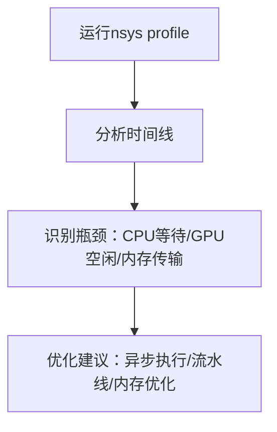
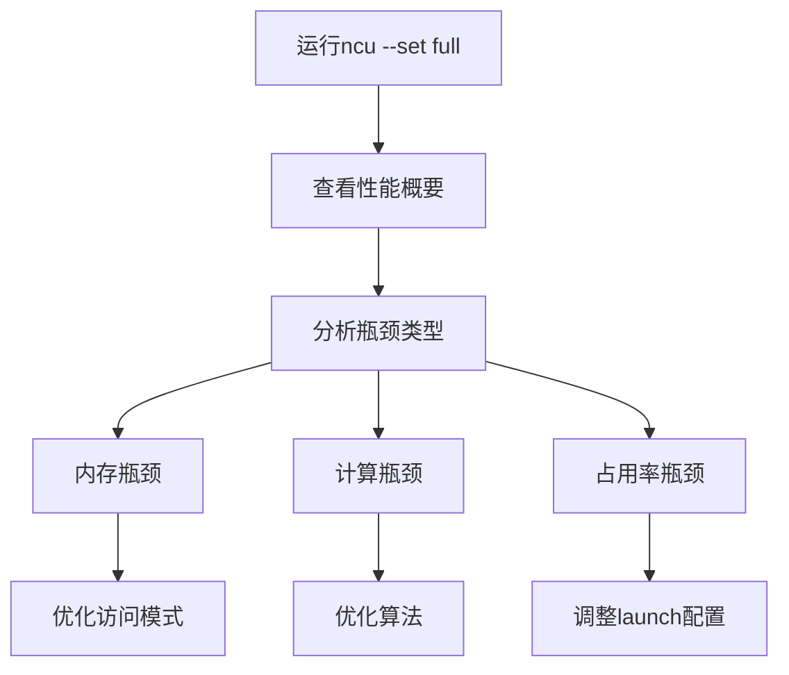

# NVIDIA Profiler工具

## 工具概览

### NVIDIA Profiler工具家族
- **Nsight Compute**：现代kernel级性能分析器（替代nvprof）
- **Nsight Systems**：系统级性能分析器（替代nvvp）
- **Nsight Graphics**：图形应用性能分析器
- **nvprof**：传统命令行分析器（已弃用）
- **NVVP**：传统可视化分析器（已弃用）

### 发展历程
```timeline
2010-2019: nvprof + NVVP 时代
2019-至今: Nsight Compute + Nsight Systems 时代
```

## Nsight Compute (ncu)

### 核心功能
- **Kernel级分析**：深入分析单个kernel的性能
- **指标收集**：收集数千个性能计数器
- **瓶颈识别**：自动识别性能瓶颈
- **优化建议**：提供具体的优化建议

### 基本使用方法

#### 1. 命令行基础
```bash
# 基本profiling
ncu ./your_program

# 分析特定kernel
ncu --kernel-name "your_kernel" ./your_program

# 收集所有指标
ncu --set full ./your_program

# 输出到文件
ncu -o profile_result ./your_program
```

#### 2. 常用指标收集
```bash
# 内存带宽分析
ncu --metrics dram__throughput.avg.pct_of_peak_sustained_elapsed \
    --metrics memory__throughput.avg.pct_of_peak_sustained_elapsed \
    ./your_program

# 占用率分析
ncu --metrics sm__warps_active.avg.pct_of_peak_sustained_active \
    ./your_program

# 缓存命中率
ncu --metrics l1tex__t_sector_hit_rate.pct \
    --metrics lts__t_sector_hit_rate.pct \
    ./your_program

# 计算利用率
ncu --metrics sm__pipe_tensor_cycles_active.avg.pct_of_peak_sustained_active \
    --metrics sm__pipe_fp32_cycles_active.avg.pct_of_peak_sustained_active \
    ./your_program
```

#### 3. 高级分析选项
```bash
# 分析所有kernel实例
ncu --kernel-id ::regex:.*kernel.* ./your_program

# 限制分析的kernel启动次数
ncu --launch-count 5 ./your_program

# 分析特定GPU
ncu --devices 0 ./your_program

# 详细的源码分析
ncu --source-folders /path/to/source ./your_program
```

### GUI界面使用
```bash
# 生成可视化报告
ncu --set full -o detailed_report ./your_program

# 在GUI中打开
ncu-ui detailed_report.ncu-rep
```

## Nsight Systems (nsys)

### 核心功能
- **系统级分析**：分析整个应用的时间线
- **CPU+GPU协调**：展示CPU和GPU的协作关系
- **API调用跟踪**：CUDA API、驱动API调用
- **内存传输分析**：Host-Device数据传输

### 基本使用方法

#### 1. 时间线分析
```bash
# 基本时间线收集
nsys profile ./your_program

# 指定输出文件
nsys profile -o timeline_report ./your_program

# 收集更多信息
nsys profile --trace=cuda,nvtx,cublas,cudnn ./your_program
```

#### 2. 详细配置选项
```bash
# 指定分析时长
nsys profile --duration=30 ./your_program

# 延迟开始分析
nsys profile --delay=5 ./your_program

# 采样分析（适合长时间运行的程序）
nsys profile --sample=cpu --cpuctxsw=true ./your_program

# GPU指标收集
nsys profile --gpu-metrics-device=0 ./your_program
```

#### 3. 过滤和优化
```bash
# 只分析CUDA相关
nsys profile --trace=cuda --cuda-memory-usage=true ./your_program

# 分析特定时间段
nsys profile --capture-range=cudaProfilerApi ./your_program

# 高频采样
nsys profile --sample=cpu --sampling-frequency=10000 ./your_program
```

### GUI分析
```bash
# 生成报告并在GUI中打开
nsys profile -o system_report ./your_program
nsight-sys system_report.nsys-rep
```

## 传统工具（面试可能涉及）

### nvprof（已弃用）
```bash
# 基本使用（历史知识）
nvprof ./your_program

# 指标收集
nvprof --metrics achieved_occupancy,branch_efficiency ./your_program

# 事件收集
nvprof --events elapsed_cycles_sm ./your_program

# 输出到文件
nvprof -o profile.nvprof ./your_program
```

### NVVP（已弃用）
- 可视化性能分析器
- 时间线视图
- 指标分析视图
- 已被Nsight Systems替代

## 关键性能指标详解

### 1. 内存相关指标
```bash
# 全局内存带宽利用率
dram__throughput.avg.pct_of_peak_sustained_elapsed

# L1缓存命中率
l1tex__t_sector_hit_rate.pct

# L2缓存命中率
lts__t_sector_hit_rate.pct

# 内存事务效率
global_hit_rate
```

### 2. 计算相关指标
```bash
# SM占用率
sm__warps_active.avg.pct_of_peak_sustained_active

# 指令吞吐量
sm__inst_executed.avg.per_cycle_elapsed

# 分支效率
smsp__sass_branch_targets_threads_divergent.pct

# 算术强度
flop_count_sp / dram_read_bytes
```

### 3. 效率指标
```bash
# Warp执行效率
smsp__thread_inst_executed_per_inst_executed.ratio

# 内存合并效率
global_load_efficiency
global_store_efficiency

# 共享内存银行冲突
shared_load_transactions_per_request
```

## 实际分析案例

### 案例1：矩阵乘法优化分析
```bash
# 第一步：整体性能分析
nsys profile -o matmul_timeline ./matmul_app

# 第二步：kernel详细分析
ncu --set full --kernel-name "matmul_kernel" -o matmul_kernel ./matmul_app

# 第三步：内存带宽分析
ncu --metrics dram__throughput.avg.pct_of_peak_sustained_elapsed \
    --metrics global_load_efficiency \
    --metrics global_store_efficiency \
    ./matmul_app
```

### 案例2：占用率问题诊断
```bash
# 分析占用率限制因素
ncu --metrics sm__maximum_warps_per_active_cycle_pct \
    --metrics launch__occupancy_per_block_size \
    --metrics launch__occupancy_limit_blocks \
    --metrics launch__occupancy_limit_registers \
    --metrics launch__occupancy_limit_shared_mem \
    ./your_program
```

### 案例3：内存访问模式分析
```bash
# 分析内存合并情况
ncu --metrics l1tex__m_xbar2l1tex_read_sectors.sum \
    --metrics l1tex__t_sectors_pipe_lsu_mem_global_op_ld.sum \
    --metrics global_load_efficiency \
    ./your_program
```

## 性能优化工作流

### 1. 系统级分析（Nsight Systems）


### 2. Kernel级分析（Nsight Compute）


## 高级分析技巧

### 1. 自定义指标收集
```bash
# 创建自定义指标集
ncu --list-metrics | grep -i memory > memory_metrics.txt
ncu --metrics-file memory_metrics.txt ./your_program
```

### 2. 批量分析脚本
```bash
#!/bin/bash
# 自动化性能分析脚本

PROGRAM=$1
OUTPUT_DIR="profile_results"

mkdir -p $OUTPUT_DIR

# 系统级分析
echo "Running system-level analysis..."
nsys profile -o $OUTPUT_DIR/system_profile $PROGRAM

# Kernel级分析
echo "Running kernel-level analysis..."
ncu --set full -o $OUTPUT_DIR/kernel_profile $PROGRAM

# 内存分析
echo "Running memory analysis..."
ncu --metrics dram__throughput.avg.pct_of_peak_sustained_elapsed,\
l1tex__t_sector_hit_rate.pct,\
lts__t_sector_hit_rate.pct \
-o $OUTPUT_DIR/memory_profile $PROGRAM

echo "Analysis complete. Results in $OUTPUT_DIR/"
```

### 3. 持续集成中的性能监控
```bash
# CI/CD管道中的性能回归检测
ncu --csv --metrics dram__throughput.avg.pct_of_peak_sustained_elapsed \
    ./your_program > current_performance.csv

# 与基线比较
python compare_performance.py baseline.csv current_performance.csv
```

## 常见问题排查

### 1. Profiler无法运行
```bash
# 检查驱动版本
nvidia-smi

# 检查CUDA版本兼容性
ncu --version
nsys --version

# 权限问题（Docker环境）
docker run --gpus all --cap-add=SYS_ADMIN ...
```

### 2. 数据收集失败
```bash
# 减少收集的指标
ncu --metrics sm__warps_active.avg.pct_of_peak_sustained_active ./program

# 限制分析的kernel数量
ncu --launch-count 1 ./program

# 检查GPU兼容性
ncu --query-devices
```

### 3. 性能开销过大
```bash
# 使用采样模式
nsys profile --sample=cpu ./long_running_program

# 限制分析时间
nsys profile --duration=10 ./program

# 选择性tracing
nsys profile --trace=cuda ./program
```

## 面试重点总结

### 必须掌握的知识点
1. **工具选择**：什么时候用Nsight Compute vs Nsight Systems
2. **关键指标**：占用率、内存带宽、缓存命中率的含义
3. **分析流程**：从系统级到kernel级的分析方法
4. **优化方向**：如何根据profiler结果确定优化方向

### 常见面试问题

1. **Q: Nsight Compute和Nsight Systems的区别？**
   - A: Nsight Compute专注kernel级分析，Nsight Systems专注系统级时间线分析

2. **Q: 如何使用profiler诊断内存带宽问题？**
   - A: 查看dram__throughput指标，分析global_load/store_efficiency，检查访问模式

3. **Q: 如何分析GPU占用率低的原因？**
   - A: 使用occupancy相关指标，检查registers、shared memory、block size限制

4. **Q: nvprof和Nsight Compute的主要区别？**
   - A: nvprof已弃用，Nsight Compute提供更详细的分析和现代化界面

5. **Q: 在生产环境中如何进行性能监控？**
   - A: 使用轻量级指标收集，集成到CI/CD，设置性能回归检测

### 实用建议
- 始终从系统级分析开始（nsys）
- 识别热点kernel后深入分析（ncu）
- 关注指标趋势而非绝对值
- 结合多个指标综合判断
- 验证优化效果要重新测量

### 工具使用最佳实践
- 在debug模式和release模式都要测试
- 注意profiler本身的性能开销
- 保存基线性能数据用于对比
- 使用脚本自动化重复分析任务

---

## 相关笔记
<!-- 自动生成 -->

- [GPU利用率分析](notes/cuda/GPU利用率分析.md) - 相似度: 33% | 标签: cuda, cuda/GPU利用率分析.md

