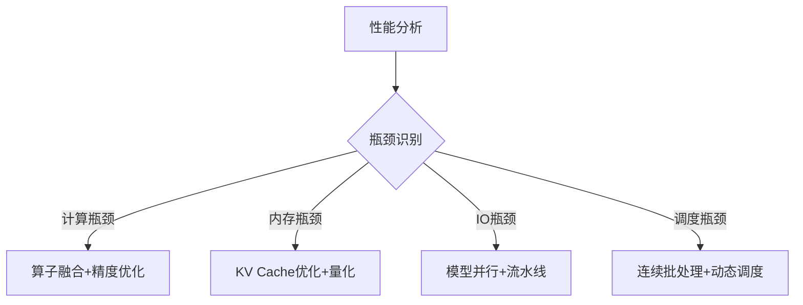

# 在LLM推理中，主要的性能瓶颈有哪些？（计算、内存、IO等）

## 面试标准答案（精简版）

**LLM推理的主要瓶颈包括：计算瓶颈（Prefill阶段算力不足）、内存瓶颈（Decode阶段带宽限制、KV Cache容量）、IO瓶颈（模型加载、分布式通信）。不同阶段瓶颈不同，需要针对性优化。**

## 详细技术解析

### 1. 瓶颈分类概述

LLM推理的性能瓶颈可以从多个维度进行分析，主要包括：

```
计算瓶颈 → GPU算力限制
内存瓶颈 → 带宽 + 容量限制  
IO瓶颈 → 数据传输延迟
调度瓶颈 → 资源分配效率
```

### 2. 计算瓶颈 (Compute-bound)

#### 2.1 主要表现场景
- **Prefill阶段**：大batch size时GPU算力成为限制因素
- **大模型推理**：参数量超过GPU并行计算能力
- **复杂算子**：Attention、LayerNorm等计算密集型操作

#### 2.2 具体瓶颈分析
```
FLOPs需求: Transformer O(n²d) 复杂度
GPU峰值算力: A100约312 TFLOPS (FP16)
实际利用率: 通常仅60-80%
瓶颈原因: 算子融合不足、kernel效率低
```

#### 2.3 优化策略
```python
# 算子融合示例
class FusedMLP(nn.Module):
    def forward(self, x):
        # 融合Linear + Activation + Linear
        return self.fused_operation(x)  # 减少kernel启动开销

# 混合精度计算
with torch.autocast(device_type='cuda', dtype=torch.float16):
    output = model(input_ids)  # 使用FP16加速计算
```

### 3. 内存瓶颈 (Memory-bound)

#### 3.1 内存带宽瓶颈

**主要影响阶段：Decode阶段**

```
问题根源: 
- 每生成1个token需要访问整个KV Cache
- KV Cache大小: batch_size × seq_len × hidden_dim × layers
- GPU内存带宽: A100约1.6TB/s，实际利用率<50%

计算vs访存比例:
- Prefill: 计算密集，访存比例低
- Decode: 访存密集，计算比例低 (Memory Wall)
```

#### 3.2 KV Cache容量瓶颈

**容量限制分析：**
```python
# KV Cache内存占用计算
def calculate_kv_cache_memory(batch_size, seq_len, num_layers, hidden_dim):
    # K和V矩阵各占一份
    kv_memory = 2 * batch_size * seq_len * hidden_dim * num_layers * 2  # FP16
    return kv_memory / (1024**3)  # GB

# 示例：LLaMA-7B
memory_usage = calculate_kv_cache_memory(
    batch_size=32, seq_len=2048, num_layers=32, hidden_dim=4096
)
# 结果：约32GB KV Cache内存
```
 
#### 3.3 显存碎片化问题
```
问题表现:
- 动态序列长度导致内存分配不规整
- 频繁的内存分配/释放造成碎片
- 长序列请求阻塞整体吞吐量

解决方案:
- PagedAttention: 分页式KV Cache管理
- 内存池预分配: 减少动态分配开销
```

### 4. IO瓶颈

#### 4.1 模型加载瓶颈
```
瓶颈来源:
- 模型权重加载: 7B模型约14GB，175B模型约350GB
- 存储IO速度: NVMe SSD ~7GB/s，网络加载更慢
- 冷启动延迟: 首次推理前的模型加载时间

优化策略:
- 模型预加载和热备
- 权重量化减少传输量
- 分布式模型并行加载
```

#### 4.2 分布式通信瓶颈
```python
# 张量并行通信开销
class DistributedLinear(nn.Module):
    def forward(self, x):
        # All-Reduce通信成本
        local_output = self.local_linear(x)
        # 通信瓶颈: 跨节点带宽限制
        global_output = all_reduce(local_output)
        return global_output

# 通信优化
# 1. 通信计算重叠
# 2. 梯度压缩
# 3. 拓扑感知通信
```

### 5. 调度瓶颈

#### 5.1 批处理效率问题
```
静态批处理局限:
- 等待最长序列完成才能开始新batch
- GPU利用率随序列长度差异下降
- 无法有效处理动态负载

连续批处理优势:
- 动态添加/移除序列
- 提高GPU利用率
- 降低平均延迟
```

#### 5.2 资源分配不均衡
```python
# 调度策略示例
class RequestScheduler:
    def schedule_requests(self, pending_requests):
        # 考虑序列长度、优先级、SLA要求
        prefill_batch = self.select_prefill_requests()
        decode_batch = self.select_decode_requests()
        
        # 资源分配优化
        return self.optimize_resource_allocation(prefill_batch, decode_batch)
```

### 6. 瓶颈识别与诊断

#### 6.1 性能分析工具
```bash
# GPU利用率监控
nvidia-smi dmon -s pucvmet -d 1

# 内存带宽分析  
nsys profile --stats=true python inference.py

# 通信开销分析
ncu --metrics memory__throughput.avg.pct_of_peak_sustained_elapsed
```

#### 6.2 瓶颈判断标准
```python
def diagnose_bottleneck(metrics):
    if metrics.gpu_utilization > 90:
        return "Compute-bound"
    elif metrics.memory_bandwidth_util > 80:
        return "Memory-bound"
    elif metrics.pcie_util > 80:
        return "IO-bound"
    else:
        return "Scheduling inefficiency"
```

### 7. 不同场景下的主导瓶颈

| 场景           | 主导瓶颈 | 次要瓶颈 | 优化重点     |
| -------------- | -------- | -------- | ------------ |
| **在线服务**   | 内存带宽 | 调度效率 | KV Cache优化 |
| **批量推理**   | 计算能力 | IO传输   | 算子融合     |
| **长文本生成** | 内存容量 | 计算能力 | 序列并行     |
| **多模态模型** | IO带宽   | 内存容量 | 数据流水线   |

### 8. 综合优化策略

#### 8.1 系统级优化
```
硬件层面:
- 高带宽内存 (HBM)
- NVLink互连
- 专用推理芯片

软件层面:  
- 算子库优化 (cuBLAS, Flash Attention)
- 编译器优化 (TensorRT, TorchScript)
- 调度器改进 (vLLM, FasterTransformer)
```

#### 8.2 针对性优化路径


### 9. 未来发展趋势

- **硬件专用化**：专门的LLM推理芯片
- **算法创新**：稀疏注意力、线性注意力
- **系统优化**：端到端的推理框架优化
- **混合架构**：CPU+GPU+专用加速器协同

---

## 相关笔记
<!-- 自动生成 -->

- [请描述大语言模型的推理过程，包括prefill和decode阶段的特点？](notes/vllm/请描述大语言模型的推理过程，包括prefill和decode阶段的特点？.md) - 相似度: 31% | 标签: vllm, vllm/请描述大语言模型的推理过程，包括prefill和decode阶段的特点？.md

