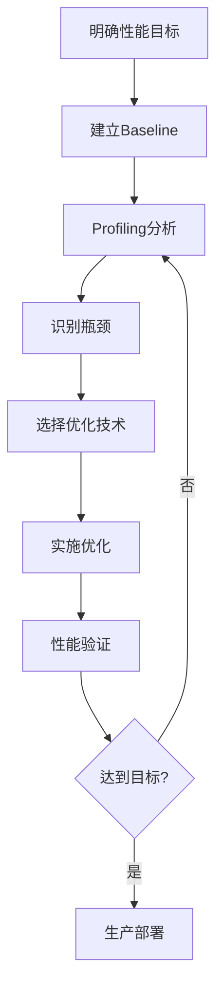

# 给定延迟和吞吐量目标，如何系统性地进行优化？

## 面试标准答案（可背诵）

首先明确延迟和吞吐量的权衡关系：延迟优化通常聚焦单请求处理速度（减小batch size、加速单步推理），吞吐量优化则关注整体处理能力（增大batch、并行处理）。系统性优化遵循"四层分析法"：**模型层**（量化、剪枝、蒸馏等减少计算量）、**算子层**（FlashAttention、算子融合等提升执行效率）、**系统层**（KV Cache管理、Continuous Batching等资源调度）、**硬件层**（Tensor Core利用、多卡并行等）。实践中采用"测量-分析-优化-验证"的迭代流程，使用profiling工具定位瓶颈（Prefill阶段计算密集、Decode阶段内存密集），针对性应用技术，最后通过A/B测试验证效果。关键是建立性能模型预估优化收益，避免盲目优化。

---

## 一、理解延迟与吞吐量的本质

### 1.1 核心指标定义

**延迟（Latency）**指单个请求从输入到输出完成的时间，通常包括：
- **首Token延迟（Time to First Token, TTFT）**：从请求到达到生成第一个token的时间，主要受Prefill阶段影响
- **每Token延迟（Time per Output Token, TPOT）**：生成每个后续token的平均时间，主要受Decode阶段影响
- **端到端延迟（End-to-End Latency）**：整个请求的总处理时间

**吞吐量（Throughput）**指单位时间内系统能处理的请求数量或生成的token数量：
- **请求吞吐量**：每秒处理的请求数（Requests per Second, RPS）
- **Token吞吐量**：每秒生成的token数（Tokens per Second, TPS）

### 1.2 两者的权衡关系

延迟和吞吐量往往存在矛盾：

| 维度       | 延迟优化策略             | 吞吐量优化策略         | 冲突点                          |
| ---------- | ------------------------ | ---------------------- | ------------------------------- |
| Batch Size | 小（batch=1）            | 大（batch=32-128）     | 增大batch提升吞吐但增加排队时间 |
| 并行策略   | 张量并行（减少单步时间） | 数据并行（增加副本数） | 张量并行引入通信开销            |
| KV Cache   | 小batch节省内存          | 大batch需要大量内存    | 内存限制batch上限               |
| 资源利用   | 低GPU利用率              | 高GPU利用率            | 空闲等待 vs 计算饱和            |

**核心原理**：
- **延迟敏感场景**（如实时对话）：需要快速响应，牺牲部分硬件利用率
- **吞吐量敏感场景**（如批量文本生成）：追求最大处理能力，容忍排队等待

---

## 二、系统性优化方法论框架

### 2.1 四层优化体系

```
模型层优化（10-100x加速）
    ↓ 减少计算量
算子层优化（2-10x加速）
    ↓ 提升执行效率
系统层优化（2-5x加速）
    ↓ 资源调度与内存管理
硬件层优化（1.5-3x加速）
    ↓ 硬件特性利用
```

**优化优先级原则**：
1. **先粗后细**：从模型层大幅减少计算量开始（如INT8量化可减少4倍计算）
2. **抓主要矛盾**：通过profiling识别瓶颈（计算绑定 vs 内存绑定）
3. **投入产出比**：优先选择实施简单、收益明显的技术

### 2.2 标准优化流程



**关键步骤说明**：
- **建立Baseline**：记录原始性能（延迟、吞吐量、内存占用、GPU利用率）
- **Profiling工具**：Nsight Systems（系统级）、Nsight Compute（kernel级）、PyTorch Profiler
- **瓶颈类型**：
  - Prefill阶段：通常计算密集，受GEMM性能影响
  - Decode阶段：通常内存密集，受内存带宽限制

---

## 三、针对不同目标的优化策略

### 3.1 场景一：优化延迟（Latency-Driven）

**典型目标**：TTFT < 200ms，TPOT < 50ms

#### 3.1.1 模型层优化

**1. 模型量化**
- **INT8/FP16混合精度**：减少计算时间和内存访问
  - 使用SmoothQuant或GPTQ等PTQ方法
  - 关键：对Attention层使用FP16保证精度，FFN层用INT8加速
- **效果预期**：TTFT降低30-50%，TPOT降低20-40%

**2. 模型架构选择**
- **Multi-Query Attention (MQA)**：减少KV Cache大小，降低内存访问延迟
  - 示例：PaLM使用MQA后单步推理加速1.3-1.5x
- **Grouped-Query Attention (GQA)**：在MQA和MHA之间平衡质量与速度

**3. 投机解码（Speculative Decoding）**
- 使用小模型draft多个token，大模型并行验证
- **适用条件**：draft模型接受率 > 50%
- **效果预期**：2-3x端到端加速（取决于接受率）

#### 3.1.2 算子层优化

**1. FlashAttention**
- 减少HBM访问，降低Attention延迟
- **Prefill阶段加速**：2-4x（长序列更明显）
- **Decode阶段加速**：1.5-2x

**2. 算子融合**
- 融合LayerNorm + Linear + Activation
- 减少kernel launch开销（对小batch效果显著）
- **小batch加速**：10-20%

**3. 自定义Kernel**
- 针对特定形状优化GEMM（避免padding浪费）
- 使用Triton快速实现和迭代

#### 3.1.3 系统层优化

**1. 减小Batch Size**
- **batch=1**：最低延迟，但GPU利用率低（20-40%）
- **权衡方案**：使用Continuous Batching在保持低延迟的同时提高利用率

**2. 张量并行（Tensor Parallelism）**
- 将单层计算分布到多GPU，减少单步时间
- **适用场景**：大模型（>30B参数）在延迟敏感任务
- **注意**：通信开销可能抵消收益（需NVLink支持）

**3. KV Cache预分配**
- 避免动态内存分配的开销
- 使用PagedAttention减少内存碎片

#### 3.1.4 硬件层优化

**1. Tensor Core充分利用**
- 确保矩阵维度对齐到16的倍数（FP16）或8的倍数（INT8）
- 使用cuBLAS的cublasGemmEx API指定Tensor Core路径

**2. 高带宽GPU选择**
- A100 (1.9TB/s) vs V100 (900GB/s)：内存绑定算子加速2x
- H100 (3.3TB/s)：进一步提升

**3. 降低通信延迟**
- 使用NVLink替代PCIe（300GB/s vs 64GB/s）
- NCCL优化集合通信

### 3.2 场景二：优化吞吐量（Throughput-Driven）

**典型目标**：TPS > 10000，GPU利用率 > 80%

#### 3.2.1 模型层优化

**1. 激进量化**
- **INT4权重量化**：使用GPTQ或AWQ
  - 内存占用减少4倍，可支持更大batch
- **KV Cache量化**：INT8量化KV Cache，节省50%内存
- **效果预期**：batch size增大2-4倍

**2. 模型蒸馏**
- 使用小模型替代大模型
- 示例：Llama-7B蒸馏到Llama-3B，吞吐量提升2.5x

#### 3.2.2 算子层优化

**1. PagedAttention**
- 动态内存管理，减少碎片化
- **内存利用率提升**：从60%到90%
- **batch size增大**：1.5-2x

**2. 批量GEMM优化**
- 使用cuBLAS的batched GEMM接口
- 大batch下算力利用率接近峰值（>85%）

#### 3.2.3 系统层优化

**1. Continuous Batching**
- 动态调整batch组成，减少等待时间
- **吞吐量提升**：2-5x（对比静态batching）
- **实现**：vLLM、TensorRT-LLM的In-flight Batching

**2. 数据并行**
- 部署多个模型副本，负载均衡
- **扩展性**：近线性（4卡 → 3.8x吞吐量）

**3. KV Cache共享**
- Beam Search时共享公共前缀的KV Cache
- Copy-on-Write机制减少内存拷贝

**4. Prompt Cache**
- 缓存常见prompt的KV Cache
- **场景**：多轮对话、RAG等重复前缀场景
- **效果**：首token延迟降低50-80%

#### 3.2.4 硬件层优化

**1. 增大Batch Size**
- 利用更大显存（A100 80GB vs 40GB）
- **batch size翻倍**：吞吐量提升1.7-1.9x

**2. 流水线并行**
- 长生成任务中可忍受流水线气泡
- **吞吐量**：在气泡<20%时仍可获得2-3x加速

### 3.3 场景三：平衡延迟与吞吐量

**典型目标**：P99延迟 < 500ms，同时吞吐量 > 5000 TPS

#### 3.3.1 核心策略

**1. 动态Batch Size调整**
```python
if request_queue_length < 5:
    batch_size = 1  # 低负载优先延迟
elif request_queue_length < 20:
    batch_size = 8  # 中等负载平衡
else:
    batch_size = 32  # 高负载优先吞吐
```

**2. 多模型混合部署**
- **延迟模型**：batch=1-4，张量并行，占GPU资源30%
- **吞吐模型**：batch=32-64，数据并行，占GPU资源70%
- 根据请求优先级路由

**3. SLO（Service Level Objective）驱动调度**
- 为每个请求设置deadline
- 优先调度接近deadline的请求
- 动态抢占长时间运行的低优先级请求

#### 3.3.2 关键技术组合

| 技术                | 延迟影响 | 吞吐量影响 | 适用条件        |
| ------------------- | -------- | ---------- | --------------- |
| FP16量化            | ↓ 30%    | ↑ 1.8x     | 精度损失可接受  |
| FlashAttention      | ↓ 40%    | ↑ 2.5x     | 长序列（>2048） |
| Continuous Batching | ↓ 20%    | ↑ 3x       | 请求到达随机    |
| MQA                 | ↓ 25%    | ↑ 1.5x     | 模型训练支持    |
| PagedAttention      | ↑ 5%     | ↑ 2x       | 内存碎片严重    |

---

## 四、实战优化流程示例

### 4.1 案例：优化Llama-2 13B模型

**初始状态**：
- 硬件：A100 40GB × 1
- Batch size = 8
- TTFT = 800ms，TPOT = 120ms
- 吞吐量 = 1200 TPS
- GPU利用率 = 45%

**优化目标**：TTFT < 300ms，吞吐量 > 3000 TPS

#### 步骤1：Profiling分析

使用Nsight Systems分析：
- Prefill阶段：GEMM占70%时间（计算密集）
- Decode阶段：内存访问占65%时间（内存密集）
- KV Cache占用：18GB（45%总内存）

**结论**：内存是主要瓶颈，需减少KV Cache占用以增大batch

#### 步骤2：模型层优化

**实施FP16混合精度 + KV Cache INT8量化**
```
内存占用：40GB → 28GB（KV Cache从18GB降到9GB）
TTFT：800ms → 600ms（-25%）
TPOT：120ms → 95ms（-21%）
```

#### 步骤3：算子层优化

**集成FlashAttention-2**
```
TTFT：600ms → 400ms（-33%）
TPOT：95ms → 70ms（-26%）
内存进一步节省：28GB → 24GB
```

#### 步骤4：系统层优化

**启用PagedAttention + Continuous Batching**
```
最大batch size：8 → 24（内存利用率从60%到85%）
吞吐量：1200 TPS → 3600 TPS（+200%）
TTFT（平均）：400ms → 350ms（-12%，得益于更快调度）
GPU利用率：45% → 78%
```

#### 步骤5：针对延迟进一步优化

**引入投机解码（使用Llama-2 7B作为draft model）**
```
TTFT：350ms → 280ms（-20%）
TPOT：70ms → 45ms（-36%，draft接受率60%）
吞吐量轻微下降：3600 TPS → 3400 TPS（需额外计算draft）
```

**最终结果**：
- ✅ TTFT = 280ms < 300ms
- ✅ 吞吐量 = 3400 TPS > 3000 TPS
- GPU利用率 = 82%

### 4.2 关键经验总结

1. **量化是性价比最高的优化**：实施简单，收益明显（30-50%加速）
2. **FlashAttention必选**：长序列场景下几乎无成本加速
3. **Continuous Batching解决调度难题**：显著提升吞吐量同时不增加延迟
4. **投机解码需谨慎**：draft模型质量决定效果，需实验验证
5. **内存管理是关键**：KV Cache优化直接影响最大batch size

---

## 五、优化决策树

```
┌─ 是否有明确的延迟要求？
│   ├─ 是（<200ms）
│   │   ├─ 使用小batch（1-4）
│   │   ├─ 张量并行（如模型>30B）
│   │   ├─ FlashAttention
│   │   └─ 投机解码（如接受率>50%）
│   │
│   └─ 否，主要关注吞吐量
│       ├─ 大batch（32-128）
│       ├─ PagedAttention + Continuous Batching
│       ├─ KV Cache量化
│       └─ 数据并行扩展
│
├─ 内存是否是瓶颈？
│   ├─ 是（KV Cache占用>50%）
│   │   ├─ KV Cache INT8量化
│   │   ├─ PagedAttention
│   │   └─ MQA/GQA架构
│   │
│   └─ 否，主要是计算瓶颈
│       ├─ INT8/FP16量化
│       ├─ 算子融合
│       └─ Tensor Core优化
│
└─ 是否可接受精度损失？
    ├─ 是（任务鲁棒）
    │   ├─ INT4量化（GPTQ/AWQ）
    │   ├─ 模型剪枝
    │   └─ 模型蒸馏
    │
    └─ 否（严格精度要求）
        ├─ FP16混合精度
        ├─ FlashAttention
        └─ 系统层优化为主
```

---

## 六、常见陷阱与注意事项

### 6.1 优化陷阱

1. **盲目增大Batch Size**
   - 错误：认为batch越大吞吐量越高
   - 现实：batch超过32后收益递减，且延迟急剧增加
   - 建议：通过实验找到"拐点"batch size

2. **忽略通信开销**
   - 错误：认为4卡张量并行必然4x加速
   - 现实：通信可能占50%时间，实际加速2.5x
   - 建议：优先数据并行，仅大模型用张量并行

3. **过度优化非瓶颈环节**
   - 错误：花费大量时间优化仅占5%时间的算子
   - 建议：遵循Amdahl定律，聚焦主要瓶颈

### 6.2 性能验证要点

1. **真实负载测试**
   - 使用生产环境的请求长度分布
   - 模拟并发请求到达模式

2. **长尾延迟关注**
   - 不仅看平均延迟，更要看P95、P99延迟
   - SLO通常基于长尾延迟设定

3. **稳定性验证**
   - 持续运行24小时，观察内存泄漏
   - 检查异常请求的处理（超长输入、超时等）

---

## 七、工具与监控

### 7.1 Profiling工具栈

| 工具                 | 用途           | 关键指标                          |
| -------------------- | -------------- | --------------------------------- |
| **Nsight Systems**   | 系统级性能分析 | kernel时间、CPU-GPU交互、内存传输 |
| **Nsight Compute**   | Kernel级优化   | 占用率、内存吞吐、Warp效率        |
| **PyTorch Profiler** | 框架层分析     | 算子耗时、内存分配                |
| **vLLM Metrics**     | 推理框架监控   | TTFT、TPOT、KV Cache使用率        |

### 7.2 生产监控指标

```python
# 关键性能指标（KPIs）
metrics = {
    # 延迟指标
    "ttft_p50": 150,  # ms
    "ttft_p99": 400,  # ms
    "tpot_p50": 30,   # ms
    "tpot_p99": 80,   # ms
    
    # 吞吐量指标
    "requests_per_second": 500,
    "tokens_per_second": 12000,
    
    # 资源利用率
    "gpu_utilization": 0.85,
    "memory_utilization": 0.75,
    "kv_cache_hit_rate": 0.60,  # Prompt Cache命中率
    
    # 质量指标
    "request_success_rate": 0.999,
    "timeout_rate": 0.001,
}
```

---

## 八、参考文献

1. **FlashAttention优化**  
   Dao, T., et al. (2022). "FlashAttention: Fast and Memory-Efficient Exact Attention with IO-Awareness."  
   https://arxiv.org/abs/2205.14135

2. **PagedAttention与vLLM**  
   Kwon, W., et al. (2023). "Efficient Memory Management for Large Language Model Serving with PagedAttention."  
   https://arxiv.org/abs/2309.06180

3. **量化技术综述**  
   Gholami, A., et al. (2022). "A Survey of Quantization Methods for Efficient Neural Network Inference."  
   https://arxiv.org/abs/2103.13630

4. **SmoothQuant**  
   Xiao, G., et al. (2023). "SmoothQuant: Accurate and Efficient Post-Training Quantization for Large Language Models."  
   https://arxiv.org/abs/2211.10438

5. **投机解码**  
   Leviathan, Y., et al. (2023). "Fast Inference from Transformers via Speculative Decoding."  
   https://arxiv.org/abs/2211.17192

6. **Continuous Batching**  
   Yu, G., et al. (2022). "Orca: A Distributed Serving System for Transformer-Based Generative Models."  
   https://www.usenix.org/conference/osdi22/presentation/yu

7. **TensorRT-LLM优化实践**  
   NVIDIA Developer Blog. "Optimizing Inference on Large Language Models with TensorRT-LLM."  
   https://developer.nvidia.com/blog/optimizing-inference-on-llms-with-tensorrt-llm/

8. **混合并行策略**  
   Narayanan, D., et al. (2021). "Efficient Large-Scale Language Model Training on GPU Clusters Using Megatron-LM."  
   https://arxiv.org/abs/2104.04473

9. **性能分析方法论**  
   Williams, S., et al. (2009). "Roofline: An Insightful Visual Performance Model for Multicore Architectures."  
   https://doi.org/10.1145/1498765.1498785

10. **Llama模型优化案例**  
    Meta AI. (2023). "Llama 2: Open Foundation and Fine-Tuned Chat Models."  
    https://arxiv.org/abs/2307.09288

